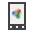

Catel.Examples.Mobile
=====================

Example where mobile code is shared to a maximum on Windows Phone, Windows RT, Xamarin.Android and Xamarin.iOS.

The app that is represented by this project isn't for end-users, but serves purely as a demo for users interested in developing apps on all platforms (Windows Store, Windows Phone, Xamarin.Android and Xamarin.iOS) using C# and Catel.

## Explanation about the project

This project shows how Catel can be used to create an application where all code can be shared on all platforms, except for the views (and some platform-specific features). Below is an overview of the projects used in the solution.

### MobileExample.Android

This is the Android project built with Xamarin for Android. The project itself only contains platform specific code:

* Views
* LinkedInclude (required to ensure that the linker won't optimize away methods and events required by late-bound code)

### MobileExample.iOS

This is the iOS project built with Xamarin for iOS. The project itself only contains platform specific code:

* Views

### MobileExample.Windows

This is the Windows Store project. The project itself only contains platform specific code:

* Views

### MobileExample.WindowsPhone

This is the Windows Store project. The project itself only contains platform specific code:

* Views

### MobileExample.Shared

This is the shared project that contains all the shared code. By default, shared projects are available for "universal apps" built with the Windows Runtime and Windows Phone Runtime. Thanks to <a href="http://visualstudiogallery.msdn.microsoft.com/315c13a7-2787-4f57-bdf7-adae6ed54450" target="_blank">this Visual Studio extension</a>, it is also applicable to other projects (such as Android and iOS in this case).

## Explanation about the app

	TODO: Write